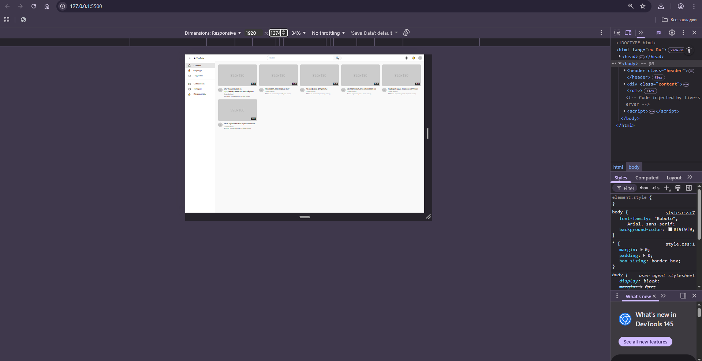
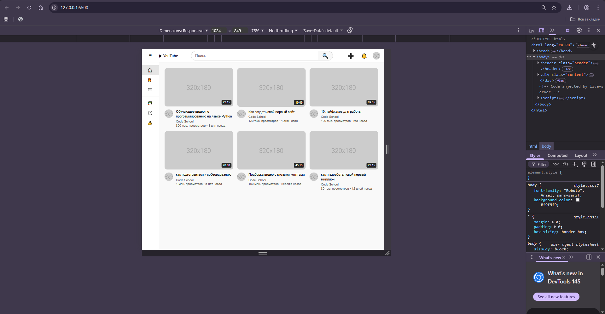

# YouTube Clone - Лабораторная работа №10-11
**Студент:** Текутова Виктория Денисовна
**Группа:** ИСП-231
---
## Описание
Адаптивный клон главной
страницы YouTube, созданный с использованием HTML, CSS, Flexbox и CSS Grid.
---
## Реализованные функции
- [ ] Адаптивный хедер с поиском
- [ ] Боковая панель навигации
- [ ] Категории (чипсы) с интерактивностью
- [ ] Сетка видео с карточками
- [ ] Hover-эффекты на карточках
- [ ] Полная адаптивность под все устройства
- [ ] [Добавьте свои функции]
---
## Технологии
- HTML5
- CSS3
- Flexbox
- CSS Grid
- Media Queries
---
## Скриншоты
### Desktop (1920px)

### Tablet (1024px)

### Mobile (375px)

---
## Как запустить
1. Откройте файл `index.html` в браузере
2. Или используйте **Live Server** в VS Code:
- Установите расширение Live Server
- Правой кнопкой по `index.html` → Open with Live Server
---
## Структура проекта
- index.html - основной код проекта
- style.css - css-стили для index.html
- README.md - описание проекта
- img/ - папка со скриншотами
---
## Вывод

В ходе выполнения лабораторной работы я изучила основы адаптивной вёрстки,
освоила работу с Flexbox и CSS Grid, научилась создавать интерактивные элементы с помощью CSS.
Проект помог мне лучше понять принципы создания современных веб-интерфейсов.

---
## Дата выполнения
27.02.2026